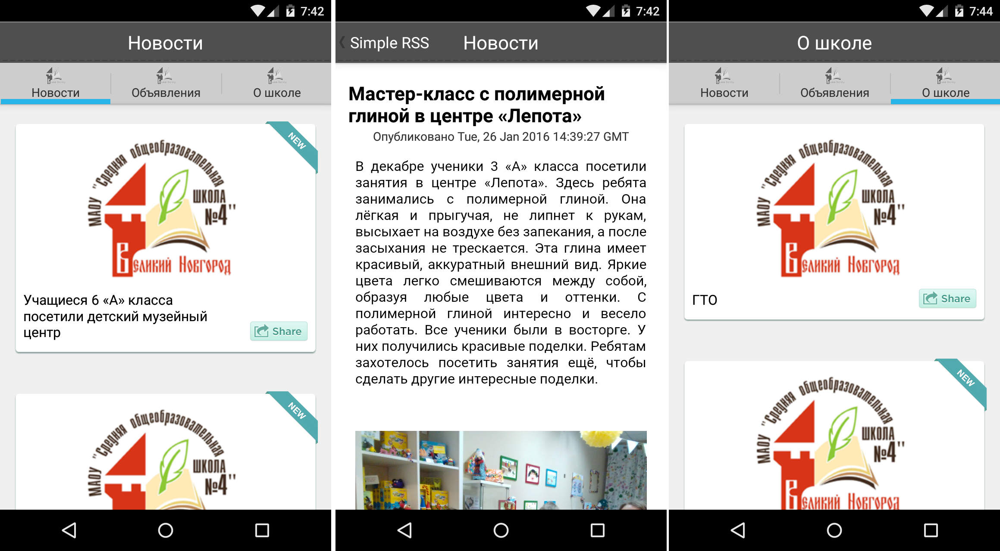

# Simple RSS for school



The application for reading RSS news feed of the "School №4" Veliky Novgorod, Russia.

Stay up to date with school events, read on your phone news, announcements and always have access to important information about your school.

The application is distributed with open source. Application is based on the [AndroidQuery library](https://github.com/androidquery/androidquery) by [Peter Liu (androidquery)](https://github.com/androidquery).

# Demo

Demo of this application can be found in `app/` folder of this repository.

# Features

* Configurable tabbed UI based on ActionBar pattern
* Easy customizable data parsing
* Based on async AndroidQuery library to perform network requests and image processing
* Support for default RSS 2.0 tags

# Add new feed

If you want to add new feed (tab) you should perform these steps:

* Add icon to `/drawable-xxx` directory. You can see icons for other tabs here.
* Add title for new feed to `strings.xml` file.
* Add feed icon, title and link to feeds configuration file config.xml. Just do it similar as for other feeds.
* Update project resources and build new app version.

# History

These sources is based on my old project that was released some time ago for Android 4.4 (API 19). This project initially was developed in Eclipse and ported to Android Studio now for better compatibility with current development environment.

The purpose of the publication of the project to demonstrate in the process of adapting an application for the new version of the Android how patterns of development are changing.

# Copyright
```
Copyright 2016 Yaroslav Veykov, Genie in a Bottle studio

Licensed under the Apache License, Version 2.0 (the "License");
you may not use this file except in compliance with the License.
You may obtain a copy of the License at

http://www.apache.org/licenses/LICENSE-2.0

Unless required by applicable law or agreed to in writing, software
distributed under the License is distributed on an "AS IS" BASIS,
WITHOUT WARRANTIES OR CONDITIONS OF ANY KIND, either express or implied.
See the License for the specific language governing permissions and
limitations under the License.
```
